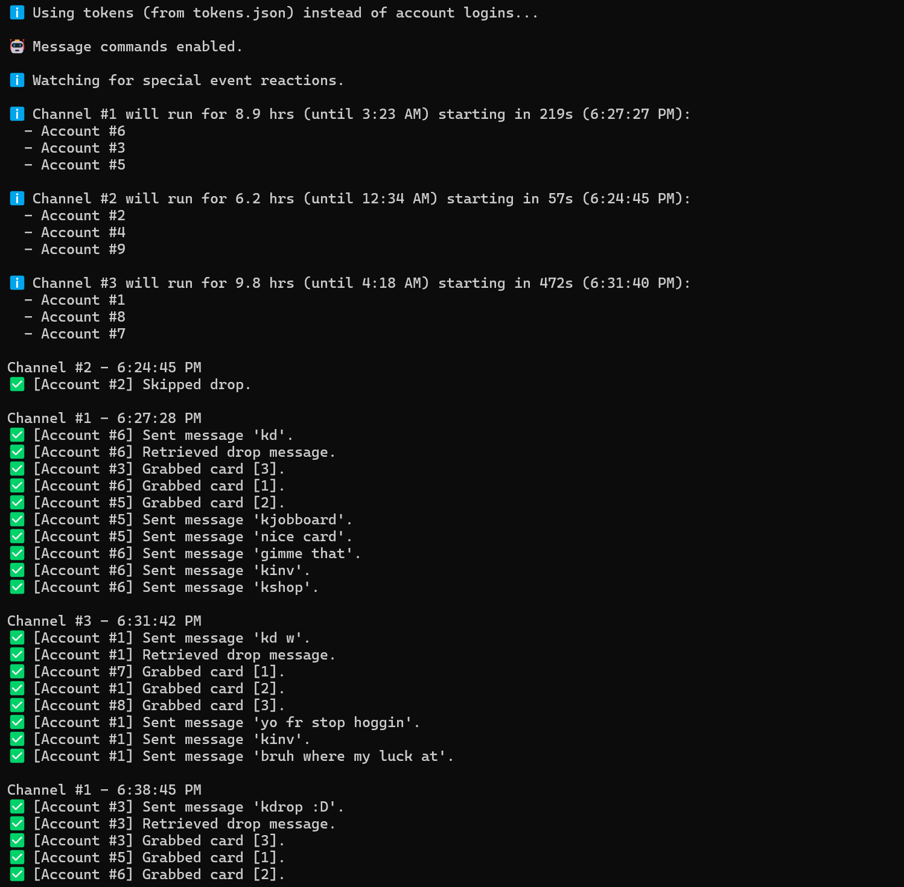

# Karuta Discord Script
Karuta Discord Script is a headless Python script for Windows that mimics realistic user behaviour to automatically drop and grab cards in Karuta, a Discord bot game.


## Terminal Preview



## ⚠️ WARNINGS (PLEASE READ) ⚠️

### ⚠️ **Be VERY CAREFUL** when trading between accounts. Karuta is EXTREMELY strict with alting and has quite a strong anti-cheat to prevent alts.

#### ⚠️ **DO NOT** run the drop script (`main.py`) for more than 10 consecutive hours or Karuta may flag your accounts for suspicious activity. Set `self.TIME_LIMIT_HOURS_MIN` and `self.TIME_LIMIT_HOURS_MAX` in `config.py` to control the time limit.

#### ⚠️ **DO NOT** run the account login script (`token_extractor.py`) too many times in a row because you will get login rate-limited by Discord Web. The cooldown after being rate-limited is typically a few hours.

Discord's Terms of Service explicitly prohibits self-bots (as of August 2025, and for the foreseeable future). Unauthorized use of this script *could* result in account bans. Use at your own risk.
- *In my experience, no accounts using this script have been banned by Discord, but I still recommend using throwaway accounts just to be safe.*

## Setup (Do this first!)
1. Clone the repository.
2. Install Python 3.13.
3. Initialize a virtual environment, then install the required dependencies by running:
```bash
pip install -r requirements.txt
```
4. Ensure the Karuta drop mode (`kdropmode`) is set to reactions, NOT buttons, in ALL the drop channels.
5. All accounts must ONLY drop 3 cards, not 4. If an accounts drops 4 cards, the fourth card will not be auto-grabbed.
6. Create/buy accounts for the script to use! I **highly recommend** purchasing FULLY VERIFIED alt accounts from a trusted shop. A fully verified account means that it has a verified email AND phone number- a phone number connected to the account is imperative because Discord frequently phone-locks suspicious accounts. (You don't need to have access to the phone, it just needs to be connected to your account.)
    - If you decide to buy accounts, I recommend purchasing from https://shop.xyliase.com/product/discord-accounts-%7C-fully-verified-tokens (I am not affiliated with this shop). As of July 2025, there is plenty of cheap stock and customer service is excellent.
7. Edit the `__init__` constants in `config.py`.
    - `self.DROP_CHANNEL_IDS` is a list of channels where the script will drop cards. 
      - **You MUST have at least 1 drop channel for every 3 accounts used.**
    - `self.SERVER_ACTIVITY_DROP_CHANNEL_IDS` is used for two purposes:
      1. During a Karuta special event, the special event account(s) will track these channels and automatically react to the special event emoji, if found.
      2. If CardCompanion is in use, the server drop account will also track these channels and automatically grab pog cards, if the setting is enabled.
      - Read more about how these two features work in Usage Tips/Features below.
8. Enter your accounts into the script. You can accomplish this via two ways:
    1. Enter your emails and passwords in `self.ACCOUNTS` in `token_extractor.py` using the following format, and then run `token_extractor.py`.
        ```python
        [{"email": "example_email@gmail.com", "password": "example_password"}, ... ]
        ```
    2. **OR**, you can enter your tokens as a list of strings in `tokens.json`. Leave the list in `tokens.json` empty if you would like to use the token extractor for account logins instead. 

    - **I recommend using tokens instead of account credentials so you can save time and avoid potential rate limiting.** If you don't have your tokens on hand, you can automatically extract and save your tokens to `tokens.json` by filling in your account credentials in `token_extractor.py`, setting `self.SAVE_TOKENS = True`, then running `token_extractor.py`.
9. Run `main.py`.

> [!TIP]
> For the script to auto-grab all dropped cards, the number of accounts you input must be a **multiple of 3** (3 accounts will *work together* in each drop channel). Make sure no accounts have 2FA enabled, and all accounts should have message access in all of `self.COMMAND_CHANNEL_IDS` and `self.DROP_CHANNEL_IDS` in `config.py`.


## Usage Tips/Features
1. **Command Checker**
    - This script has a built-in command system that allows users to send messages, reactions, and button presses from any of the accounts in `tokens.json`.
    - To set this feature up, edit the following constants in `config.py`:
      - `self.COMMAND_USER_IDS` restricts message commands to these accounts- leave this list empty if you want to allow *any* user to send commands. 
      - `self.COMMAND_CHANNEL_IDS` are the channels where you are allowed to send message commands- leave this list empty if you want to disable commands entirely.
    - To send a command from any account, manually send a message from a `self.COMMAND_USER_IDS` account in any `self.COMMAND_CHANNEL_IDS` channel using the following format (without angle brackets):
        ```bash
        cmd <account_number |OR| account_number_range |OR| 'all'> <message>
        ```
        - Ex 1. `cmd all kcollection o:wishlist` sends `kcollection o:wishlist` from ALL accounts.
        - Ex 2. `cmd 1 kgive @ExxML <card_code>` sends a card transfer from Account #1 (the first account listed in `self.ACCOUNTS`). A few seconds after the transfer is sent, the script will automatically confirm the transfer (from Account #1).
        - Ex 3. Suppose `cmd 3 kmultitrade @ExxML`. After the trade items have been entered, type `cmd 3 /lock` to lock and confirm the trade (from Account #3).
        - Ex 4. Suppose `cmd 1 kmultiburn <filters>`. When you are FULLY READY to complete the multiburn, type `cmd 1 /multiburn` to confirm the multiburn.
        - Ex 5. `cmd 1 /b <emoji / label>` clicks the button on the most recent bot message (in self.INTERACTION_BOT_IDS) with the specified emoji OR label. For example, `cmd 1 /b ✅` or `cmd 1 /b I understand`.
        - Ex 6. `cmd 1 /r <emoji>` reacts to the most recent bot message (in self.INTERACTION_BOT_IDS) with the specified emoji. For example, `cmd 1 /r 💰`.
        - Ex 7. `cmd /pause` / `cmd /resume` pauses and resumes the script.
        - Ex 8. `cmd 1-10 kinventory` sends `kinventory` from Accounts #1-10.
> [!NOTE]
> - ONLY single account arguments work with `give`, `/lock` (for kmt), `/multiburn` (for kmb), `/b`, and `/r` commands. Account number ranges and `all` will not work with those commands.
> - If you mistype the account number for the `/lock` or `/multiburn` command, you must restart the trade/burn process. Sorry!
> - Automatic confirmation for the `kburn` command will not be supported. Use the `/b 🔥` command to manually confirm the burn, or use `kmultiburn` instead.

2. **Special Event Grabber**
    - If there is a special event going on in Karuta, you can set up an account to automatically react to the event emoji(s) in all the drop channels and server activity drop channels. This feature supports multiple event emojis!
    - To set this feature up:
      1. Set `self.SPECIAL_EVENT = True` in `config.py`.
      2. Enter string key and string value pairs in `special_event_tokens.json` to automatically react to drops with the desired emoji, on the desired account.
          - For example, if I want "exampleSpecialToken2" to only grab 🌼 and "exampleSpecialToken1" to grab everything else, I would do:
            ```bash
            {
              "any": "specialEventToken1", 
              "🌼": "specialEventToken2"
            }
            ```
            - Note: "any" is the only valid special key; all other keys must be emojis. 
            - Keep in mind that there cannot be duplicate keys in a dictionary; you can only have one token associated with each emoji.
          - All special event tokens must, of course, have access to all `self.DROP_CHANNEL_IDS` and `self.SERVER_ACTIVITY_DROP_CHANNEL_IDS`.
      3. Enter the list of channels you want to track in `self.SERVER_ACTIVITY_DROP_CHANNEL_IDS`. All drops in these channels will be tracked, regardless of whether they were generated by a user or from server activity.
      4. Run `main.py`.
    - When there is no special event, you should set `self.SPECIAL_EVENT = False` to avoid accidentally reacting to drops.

3. **Server Drop Grabber**
    - You can set up accounts to watch server activity drop channels and automatically grab pog cards, as defined by CardCompanion. Note that you must have CardCompanion pog filters set up in order to use this feature.
    - To set this feature up:
      1. Set `self.GRAB_SERVER_POG_CARDS = True` in `config.py`.
      2. Enter a string in `server_token.json` with the token that you want to grab all the server pog cards on
      3. Enter the list of channels you want to track in `self.SERVER_ACTIVITY_DROP_CHANNEL_IDS`. ONLY server activity generated drops in these channels will be tracked.
      4. Run `main.py`.

## Compatibility With Other Bots
- This script can be used in conjunction with [CardCompanion](https://top.gg/bot/1380936713639166082), a Discord bot that can analyze and notify you of rare cards being dropped. If a "pog card" is dropped (a card that matches a certain stat (ex. >1000 wl)), CardCompanion will include an emoji in the message (see red circle below), indicating which card is the "pog card". The script will then ensure the grabber of the card is the same as the dropper, boosting the card stats and avoiding suspicion. If CardCompanion is not being used OR a "pog card" was not dropped, the grabber will be randomized by default.

    
    - If you have CardCompanion set up, you can use the following settings in `config.py`:
      1. If you want to ONLY grab pog cards (perhaps to make your accounts' stats look less suspicious), set `self.ONLY_GRAB_POG_CARDS` to `True`.
          - **NOTE:** While this setting is on, the script will prioritize using the dropper to grab the pog cards.
      2. If `self.ONLY_GRAB_POG_CARDS = False` but you want to occasionally skip grabbing a non-pog card, set a value for `self.SKIP_GRAB_NON_POG_CARD_RATE`. For every non-pog card dropped, there is a `self.SKIP_GRAB_NON_POG_CARD_RATE` % chance that the card will not be grabbed. Set to 0.0 if you wish to disable this feature and grab all non-pog cards. 
          - In general, you should keep this enabled (set to some value) so that not all cards in a drop are grabbed, otherwise it'll look suspicious.
      3. If you want an account to automatically grab a pog card if it appears in a server drop channel, set up the **Server Drop Grabber** (`self.GRAB_SERVER_POG_CARDS`) in **Usage Tips/Features** above.
      4. If there are pog cards in the drop, you can make the dropper attempt to grab all the pog cards in the drop (boosting card stats) by setting `self.ATTEMPT_EXTRA_POG_GRABS = True`, **using extra grabs in the process**.
          - If you want the dropper to automatically buy extra grabs after using them, set `self.ATTEMPT_BUY_EXTRA_GRABS = True`. Note that this setting will do nothing if `self.ATTEMPT_EXTRA_POG_GRABS = False`!
            - All accounts should have tickets on them in order to successfully buy the extra grabs; I recommend using the **Auto-Runner Tool** (see below) to automatically vote and get tickets.
          - **NOTE:** If there are multiple pog cards, after the dropper attempts to grab all the pog cards, the other accounts in the channel will attempt to grab the rest of the pog cards after the first one, if any. This way, pog cards will always be grabbed, even if the dropper did not have enough extra grabs.
      5. If you want all non-pog cards to be automatically burned after being grabbed, set `self.BURN_NON_POG_CARDS = True`. Note that this setting will do nothing if `self.ONLY_GRAB_POG_CARDS = True`.

- The `/b` command can also be used on any bot buttons, not just Karuta. The list of allowed bots is set in `self.INTERACTION_BOT_IDS` in `command_checker.py`, which includes OwO by default.


## Auto-Runner Tool
A separate script from the drop script above that automatically votes/works on all the accounts.
1. Follow the Setup steps above to obtain a list of tokens in `tokens.json`, or manually paste your tokens in a list.
2. Follow the Setup steps below for the Auto-Voter and Auto-Worker.
3. Run `auto_runner.py`.
- If you wish, edit `self.RAND_DELAY_MIN` and `self.RAND_DELAY_MAX` to change the (randomized) time between votes/works.
- You may also edit `self.SHUFFLE_ACCOUNTS` depending on whether you want to randomize the order of accounts for voting/working. Generally, I would recommend keeping this setting `True`.

### Top.gg Auto-Voter Setup
1. Ensure your Chrome browser is up-to-date.
2. **DO NOT** use a VPN while running this script. Cloudflare (the service Top.gg uses) flags VPNs.

### Auto-Worker Setup
1. Set up work permits and job boards on all the acccounts.
2. Ensure you have listed at least one drop channel in `config.py`. A channel in `self.DROP_CHANNEL_IDS` will be randomly selected to work in for every account.
